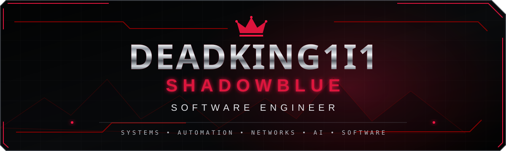
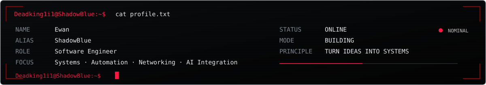
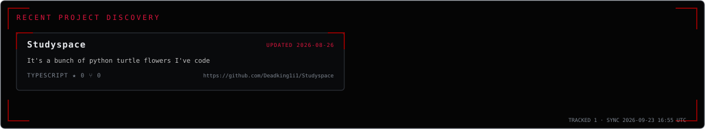
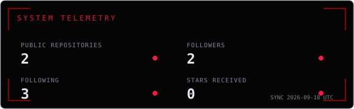
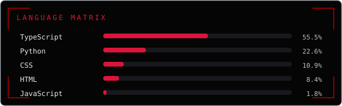
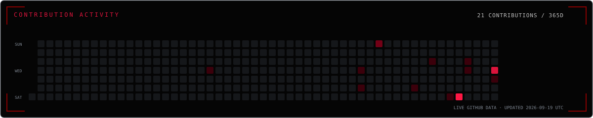

<div align="center">

<a href="https://deadking1i1.github.io/Deadking1i1/" aria-label="Open the interactive ShadowBlue system artifacts experience">
  
</a>

<sub>SELECT AN ARTIFACT TO ENTER THE INTERACTIVE SYSTEM</sub>

</div>

<p align="center">
  <a href="https://github.com/Deadking1i1"></a>
  <a href="https://deadking1i1.github.io/Deadking1i1/"></a>
</p>

<!-- Add verified LinkedIn, YouTube, X/Twitter, and portfolio URLs here when available. -->

## `> whoami`



```text
Deadking1i1@ShadowBlue:~$ cat profile.txt

Name        : Ewan
Alias       : ShadowBlue
Role        : Software Engineer
Location    : South Africa
Focus       : Systems · Automation · Networking · AI Integration
Current     : Building practical software systems
Languages   : Python · C · C++ · C# · JavaScript · TypeScript · SQL · HTML · CSS
Status      : ONLINE / BUILDING

Deadking1i1@ShadowBlue:~$ _
```

## System status

| SYSTEM | STATE | MISSION |
|:--|:--:|:--|
| **Study Space** | `● ACTIVE` | Student learning and productivity platform |
| **JVR Workshop** | `● ACTIVE` | Workshop operations and job-card system |
| **H&D Part Sales** | `● ACTIVE` | Automotive inventory and sales platform |
| **EON** | `● DEVELOPMENT` | Personal AI assistant and automation system |
| **NST** | `● DEVELOPMENT` | Network monitoring and diagnostic toolkit |


## Featured systems

### 01 / Study Space — Primary system

> A student-focused learning and productivity workspace for planning, organisation, study tools, and academic progress. Built across **Next.js, TypeScript, React, PostgreSQL, and Drizzle**, with an active migration path from its Flask foundation.

[](https://github.com/Deadking1i1/Studyspace)

### 02–05 / Operational systems

| SYSTEM | PURPOSE | DOMAIN |
|:--|:--|:--|
| **JVR Workshop** | Customers, vehicles, technicians, job cards, workflow, parts, stock, purchasing, quality control, and reporting. | `WORKSHOP` `OPERATIONS` |
| **H&D Part Sales** | Multi-brand parts search, cross-reference, warehouse location, stock control, checkout, receiving, and transaction logs. | `AUTOMOTIVE` `INVENTORY` |
| **EON** | Personal AI assistant concepts, workflow automation, messaging, and practical productivity utilities. | `AI` `AUTOMATION` |
| **NST — Networks Service Tool** | A focused personal engineering tool for network monitoring, diagnostics, and service visibility. | `NETWORKING` `DIAGNOSTICS` |

<!-- Repository links for JVR Workshop, H&D Part Sales, EON, and NST intentionally remain omitted until verified URLs are provided. -->

## Recent project discovery

<a href="https://github.com/Deadking1i1?tab=repositories">
  
</a>

> Refreshed every six hours from GitHub metadata. Featured projects remain manually curated; forks, archived repositories, the profile repository, and configured exclusions are filtered automatically.

## Technical matrix

<div align="center">


</div>

## Live telemetry

<div align="center">






</div>

> Telemetry and repository discovery are regenerated every six hours from GitHub's APIs by this repository's `update-metrics` workflow. No values are hardcoded and no third-party statistics service is required.


<div align="center">

### `BUILD SYSTEMS. BREAK LIMITS. LEAVE THINGS BETTER.`

<sub>SHADOWBLUE // SOFTWARE ENGINEER // GOOD SYSTEMS CREATE BETTER PEOPLE</sub>

</div>
